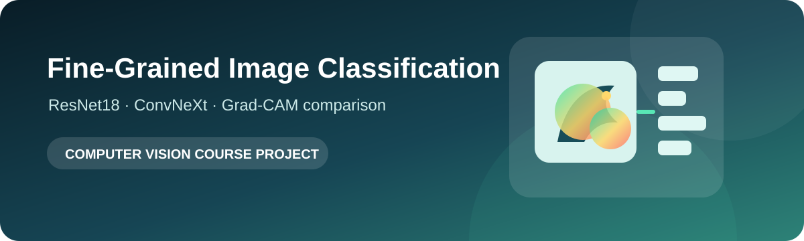
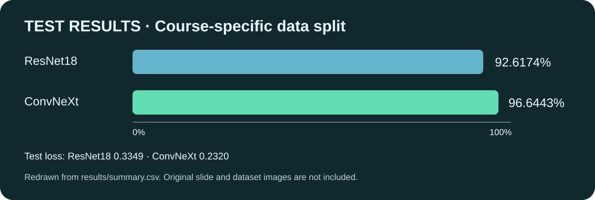
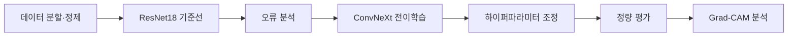
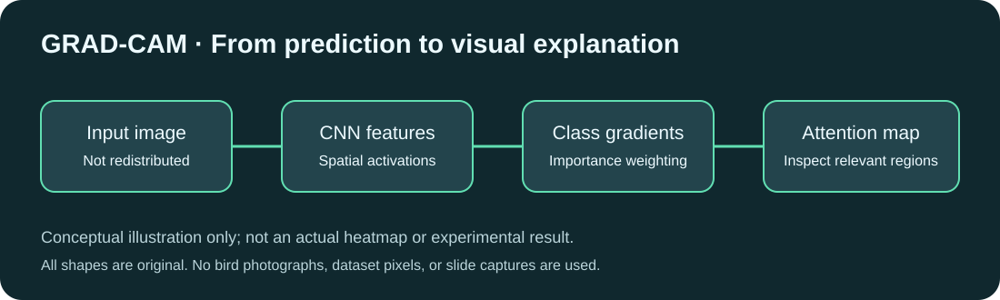

# Fine-Grained Image Classification

<p align="center">
  
</p>

> 세밀한 조류 이미지 분류에서 ResNet18과 ConvNeXt를 비교하고 Grad-CAM으로 판단 근거를 분석한 컴퓨터 비전 수업 프로젝트입니다.

## 프로젝트 설명

일반적인 객체 분류보다 클래스 간 시각적 차이가 작은 fine-grained classification 문제를 다뤘습니다. CUB-200-2011 기반 50개 클래스 수업용 분할에서 ResNet18을 기준 모델로 학습하고, ConvNeXt로 모델 용량과 표현력을 확장한 뒤 정확도·손실·시각적 설명을 비교했습니다.

## 주요 기능과 실험

- ImageFolder 형식의 학습·검증·테스트 데이터 로딩
- 사전학습 ResNet18과 ConvNeXt 전이학습
- 데이터 증강과 ImageNet 정규화
- AdamW 기반 학습과 최적 검증 가중치 저장
- 테스트 손실·정확도 비교
- Grad-CAM으로 예측에 영향을 준 영역 시각화

## 실험 결과

| Model | Test loss | Test accuracy |
|---|---:|---:|
| ResNet18 | 0.3349 | 92.6174% |
| ConvNeXt | 0.2320 | 96.6443% |

<p align="center">
  
</p>

ConvNeXt 실험은 batch size 8, 30 epochs, learning rate `0.0001`, AdamW 설정을 사용했습니다. 발표 자료와 실험 기록에 일부 숫자 차이가 있어 위 표는 최종 발표 비교표의 값을 기준으로 정리했습니다.

## 개발 과정



1. 클래스별 이미지 분할과 전처리 파이프라인을 구성했습니다.
2. ResNet18로 기준 성능을 확보하고 오분류 유형을 확인했습니다.
3. 더 큰 표현력을 가진 ConvNeXt를 적용하고 학습률·배치 크기를 조정했습니다.
4. 테스트 정확도와 손실을 비교하고 Grad-CAM으로 모델이 본 영역을 확인했습니다.

## 설명 가능성 분석

<p align="center">
  
</p>

위 그림은 직접 제작한 원리 설명도이며 실제 실험의 히트맵이 아닙니다. 원본 발표 캡처와 데이터셋 사진은 공개본에서 제외했습니다.

Grad-CAM은 모델이 새의 머리, 날개, 몸통처럼 분류에 중요한 세부 특징을 실제로 참고하는지 확인하는 데 사용했습니다. 높은 정확도만 제시하지 않고 배경 편향이나 잘못된 주목 영역을 함께 살펴보는 것이 목적입니다.

## 저장소 구성

```text
src/train.py          # 두 모델을 선택할 수 있는 정리된 학습 코드
results/summary.csv   # 최종 비교 결과
docs/                 # 직접 제작한 설명도와 결과 수치 시각화
```

## 프로젝트 범위 및 유의사항

외부 구성요소와 자료의 출처·이용 조건은 [THIRD_PARTY_NOTICES.md](THIRD_PARTY_NOTICES.md)를 참고하세요.

- 컴퓨터 비전 수업의 소규모 팀 프로젝트를 포트폴리오 형태로 정리한 저장소입니다.
- 별도의 오픈소스 라이선스를 부여하지 않았으며 코드 재사용·재배포 허가를 의미하지 않습니다.
- 원본 데이터셋의 권리는 원 저작권자와 배포 기관에 있으며 저장소에 포함하지 않았습니다.
- 대용량 모델 가중치, 개인 정보가 포함된 발표·보고서 원본, 손상된 결과 통합문서는 제외했습니다.
- `src/train.py`는 보존된 Colab 코드를 읽기 쉬운 형태로 재구성한 참고용 코드이며 원 실험 환경의 완전한 재현을 보장하지 않습니다.
- 정확도 수치는 특정 수업용 데이터 분할에서 얻은 결과로 일반적인 성능을 의미하지 않습니다.
